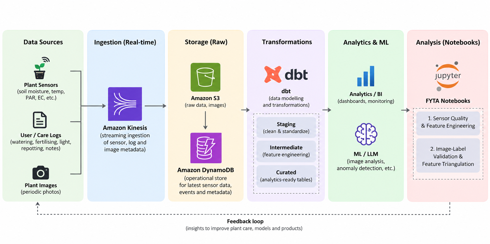

# FYTA Data Engineering Exercise

This repository explores FYTA plant sensor, contextual-event, and image data with a focus on data quality, feature engineering, cross-source validation, and interpretable triangulation.

## Notebooks

### `01_sensor_quality_features.ipynb`
- Loads raw sensor, context, and plant-device mapping data.
- Checks timestamp issues, duplicates, hard-range violations, and sudden sensor changes.
- Corrects the known SENS-07 Fahrenheit-to-Celsius issue.
- Classifies sensor records and cleans invalid individual measurements.
- Aggregates sensor readings to a plant-level feature table.
- Adds `environmental_anomaly_count` as a simple plant-specific anomaly feature.
- Writes `src/data/plant_feature_table.csv`.

### `02_cross_source_validation_60min_triangulation.ipynb`
- Validates image labels against recent sensor behaviour using a 3-hour median, Mann–Kendall trend, and plant-specific quantiles.
- Attaches recent contextual logs as supporting evidence.
- Triangulates care events using a ±60-minute before/after sensor window and nearby images within 24 hours.
- Uses event-specific rules for watering, fertilising, and light.
- Treats repotting as unavailable under the current deterministic sensor rules.
- Extracts a small set of structured features from free-text context notes.

## Run locally

Clone the repository and move into the project folder:

```bash
git clone <repo-url>
cd <repo-folder>
```

Create a virtual environment:

```bash
python -m venv .venv
```

Activate it depending on your terminal:

### Windows — Git Bash

```bash
source .venv/Scripts/activate
```

### Windows — PowerShell

```powershell
.venv\Scripts\Activate.ps1
```

### macOS / Linux

```bash
source .venv/bin/activate
```

After activation, the terminal should show `(.venv)`.

Install the project dependencies:

```bash
pip install -r requirements.txt
```

Start Jupyter:

```bash
jupyter lab
```

Run the notebooks in this order:

1. `01_sensor_quality_features.ipynb`
2. `02_cross_source_validation_60min_triangulation.ipynb`

Notebook 1 creates `plant_feature_table.csv`, which is used by Notebook 2.

## Data used

The notebooks directly use:

- `fyta_sensor_sample.csv`
- `fyta_contextual.csv`
- `fyta_images.csv`
- `user_plant_device_map.csv`
- `plant_feature_table.csv` — generated by Notebook 1 and consumed by Notebook 2

## Notes

The analysis is intentionally rule-based and interpretable. Sensor and image signals are treated as supporting evidence rather than causal proof of plant condition or user actions.

## Proposed Production Architecture

This simplified AWS-oriented architecture shows how the exercise could evolve into a production pipeline. It is a design proposal, not a representation of FYTA's exact internal architecture.


